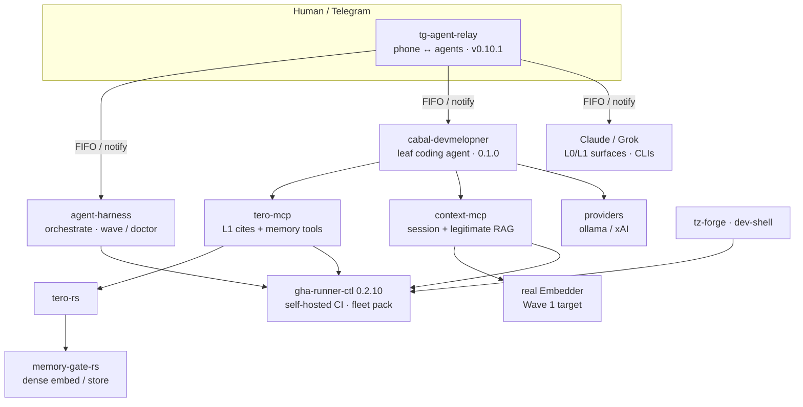
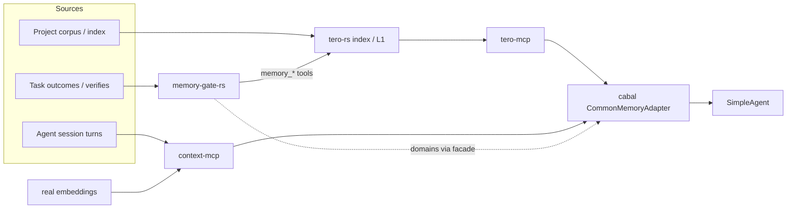

# Tooling stack readiness — cabal 1.0 workflow efficiency

**Date:** 2026-07-21  
**Purpose:** Ensure developer + AI-assisted tooling repos are **compose-ready** so cabal-devmelopner 1.0 work (and Claude↔Grok joint execution) is efficient.

Companion: [COMPOSE.md](COMPOSE.md) · [V1_0_0_GAP_ANALYSIS.md](V1_0_0_GAP_ANALYSIS.md) · [V1_0_0_JOINT_EXECUTION.md](V1_0_0_JOINT_EXECUTION.md)

---

## 1. Stack map (roles)

### Memory pipeline (target — not all wired yet)

| Layer | Today | First-steps target |
|-------|--------|-------------------|
| **tero-mcp** | Python lite L1; memory tools refuse without tero-rs binary | Prefer tero-rs binary; `scripts/smoke-memory-path.sh` |
| **tero-rs** | Standalone 0.2; optional `memory` feature | **Local smoke 2026-07-21** with `--features memory` + MG store/retrieve |
| **memory-gate-rs** | Real vector backends (sqlite-vec / qdrant) | Feed via tero-rs memory tools (`memory_hits` envelope) |
| **context-mcp** | Session KV; Wave 1 Embedder PR open | **Not legitimate RAG** until vector store + eval (Wave 2–3) |

| Repo | Role vs cabal | Version (local tip) | 1.0-workflow readiness |
|------|---------------|---------------------|------------------------|
| **cabal-devmelopner** | Leaf coding agent | 0.1.0 | **In progress** — epics E0–E8 filed |
| **tg-agent-relay** | Notify + multi-agent Telegram | **0.10.1** | **Ready** for E7.1 |
| **agent-harness** | Orchestrator / swarm dry-run | 0.1.0 | **Partial** — AJL purge done; need doctor+compose smoke vs cabal |
| **tero-mcp** | Cited L1 context | 0.1.1 | **Usable sibling** — needs path/error contract polish (E5) |
| **tero-rs** | Index / engine upstream | 0.2.0 | Consumer via tero-mcp; not cabal-direct |
| **gha-runner-ctl** | Self-hosted runners | **0.2.10** | **Ready** — 16c/16g pool, size labels |
| **security-mcp** | Secret/security gates | 0.1.7-alpha | **Ready enough** for CI wrap later; not cabal runtime dep for 1.0 |
| **agent-mcp** | Agent tooling MCP | 0.2.0 | Optional; keep boundary clear |
| **tz-forge** | Scaffold agent-swarm + cabal-profile | 0.1.0 | **Pointer compose** — verify module still points at cabal |
| **dev-shell** | Host operator shell | — | Nice-to-have for dogfood env |
| **context-mcp** | Session KV / future RAG | — | **Not RAG** until real embeddings; cabal session may use later |
| **memory-gate** | Domain memory | 0.1.0 | Facade domains mirrored; optional |

---

## 2. Efficiency gaps (tooling, not cabal core)

| ID | Gap | Impact on 1.0 workflow | Priority | Owner lane |
|----|-----|------------------------|----------|------------|
| **T1** | agent-harness not dogfooding cabal as leaf in CI dry-run | Dual systems drift | P1 | harness |
| **T2** | No single `compose doctor` that checks sibling layout (cabal+tero+relay+harness) | Slow onboarding | P0 | Grok L-ops / tz-forge |
| **T3** | tero-mcp cold-start still multi-step for new workspaces | Blocks E5 dogfood | P1 | tero-mcp + cabal E5.1 |
| **T4** | Relay notify not wired from cabal (E7.1) | No phone signal on long jobs | P1 | cabal E7 + relay |
| **T5** | gha fleet prefer-list / warm not auto-including cabal | CI latency for cabal PRs | P1 | gha ops |
| **T6** | Claude/Grok dual-lane docs not in agent-harness kickoffs | Joint exec friction | P0 | cabal V1_JOINT + harness kickoff pointer |
| **T7** | security-mcp not in cabal tool path (ok for 1.0) | — | P3 | post-1.0 |
| **T8** | context-mcp pseudo-embeddings risk overclaim | Honesty | P0 docs | E5.4 |

---

## 3. Minimum “tooling up to snuff” checklist (before heavy 1.0 impl)

### Must (blocks efficient joint work)

- [x] gha-runner-ctl **0.2.10** pool live (16c/16g)  
- [x] tg-agent-relay **0.10.1** inbound keepalives merged  
- [x] cabal **v1.0.0 milestone + epics** filed  
- [x] **compose-doctor.sh** (sibling presence)  
- [x] cabal on **GHA_PREFER_REPOS** + warm retain  
- [x] agent-harness pointer PR (#21)  
- [ ] **cabal tools write/patch usable** (E1.1) — *in flight*  
- [ ] **context-mcp real Embedder** (C1.1–C1.2) started — first memory target  

### Should (within first 1.0 weeks, after tools)

- [ ] tero-rs `--features memory` + memory-gate-rs integration smoke  
- [ ] tero-mcp default path uses tero-rs binary when present  
- [ ] cabal facade wires context-mcp session + tero L1 in one agent run  
- [ ] tero-mcp “missing index” golden error path (E5.1)  
- [ ] Telegram → relay → cabal notify (E7.1)  
- [ ] tz-forge `cabal-profile` link check  

### Later

- [ ] security-mcp wrap of `run_command`  
- [ ] context-mcp real RAG eval before any cabal “RAG” UI  

---

## 4. Recommended joint ops (Claude + Grok)

| Cadence | Action |
|---------|--------|
| Phase start | Grok updates this checklist + prefer-list/warm |
| Each L-core PR | Claude implements; Grok babysits fleet-ci |
| Each L-memory PR | Grok; Claude reviews tool/agent seams only |
| Weekly | One compose doctor run logged under `plans/evidence/` |

---

## 5. Immediate actions (this tranche)

1. Land cabal docs PR: V1 gap + joint exec + this readiness file.  
2. Add `scripts/compose-doctor.sh` (cabal) checking siblings.  
3. Ensure `tzervas/cabal-devmelopner` in gha-agent prefer-list + warm once.  
4. Point agent-harness docs at joint execution (small PR).  

---

## 6. Bottom line

The **runtime fleet** (gha-runner-ctl, tg-agent-relay) is **good enough** to execute cabal 1.0 efficiently. The **product leaf** (cabal) is the bottleneck (write/verify/stream/TUI). Tooling gaps that still waste time are **compose doctor**, **prefer-list/warm for cabal**, and **harness↔cabal kickoff alignment** — not a greenfield rebuild of MCP stack.
