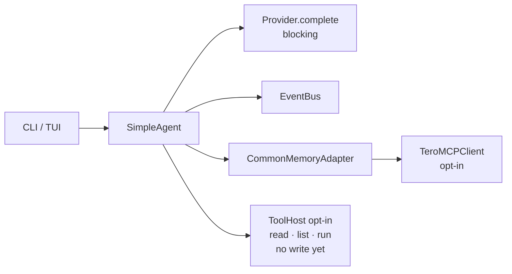

# cabal-devmelopner — 1.0.0 Gap Analysis

**Baseline:** `dev` @ `5fd9781` (fleet harden) + product tree ~2.0 kLOC under `src/cabal_devmelopner/`  
**Product version today:** **0.1.0** (alpha)  
**Analysis date:** 2026-07-21  
**Audience:** maintainer + joint Grok / Claude-Code execution  

Living companions: [INTENT_AND_GAP_ANALYSIS.md](INTENT_AND_GAP_ANALYSIS.md) (historical honesty trail), [ROADMAP.md](ROADMAP.md) (waves A–D), [OPEN_ISSUES.md](OPEN_ISSUES.md), [PHASE.md](../PHASE.md).

This document is the **1.0.0 release bar**, the **gap map from 0.1.0**, and the **epic/issue inventory** needed to close it. Older docs remain append-only history; **this file is SoT for 1.0 planning**.

---

## 1. What 1.0.0 means (product definition)

**1.0.0** = *daily co-dev agent you can trust on a real repo without hand-copying model output.*

| Pillar | 1.0.0 requirement (acceptance) |
|--------|--------------------------------|
| **Act** | With tools enabled, agent can **read / list / write (diff-safe) / run allowlisted commands** under a workspace root |
| **Verify** | After edits, runs a configured verify command (pytest/ruff/check.sh); failures re-enter the loop |
| **Remember** | Opt-in Tero L1 never silent; session **JSONL transcript** per run |
| **Configure** | `cabal.toml` profiles (L0/L1) fully drive provider/model/tools/tero; CLI overrides win |
| **Surfaces** | CLI + TUI usable for multi-step tasks (status, log, cancel, errors visible) |
| **Providers** | Local Ollama **and** xAI both first-class; streaming on both |
| **Ship** | `uv tool install` / release artifacts; fleet CI (pytest+ruff+mypy) green on self-hosted |
| **Safety** | Tool allowlist load-bearing; no unrestricted shell; budget caps (steps, tokens, wall time) |
| **Notify** | At least one external notify path (Telegram preferred for this fleet; Discord webhook optional) |

**Explicitly out of 1.0.0** (track as **1.1 / 2.0**):

- Multi-agent wave executor / LCO merge (Wave D / PROD-3)
- Full Discord control plane
- True RAG / embeddings / Tero L2 consumer (PROD-6)
- Security-MCP hard wrap of every tool (hooks ok; full wrap later)

Rationale: 1.0 ships a **single trustworthy leaf agent**. Swarm is a product after the leaf works.

---

## 2. Current reality (0.1.0 — measured 2026-07-21)

| Area | Status | Evidence |
|------|--------|----------|
| CLI + version | **Done** | `cabal-devmelopner --version` → 0.1.0 |
| Config-as-code | **Done (MVP-2 core)** | `core/config.py` + `cabal.example.toml` L0/L1; CLI/env/file precedence |
| EventBus | **Done (sync)** | CLI/TUI subscribe; TOOL_* types exist |
| Providers | **Partial** | `LocalOllamaProvider` + `XaiProvider`; **no stream API** |
| Agent loop | **Partial** | Tools path can re-prompt; non-tools still **returns on iteration 1** |
| Tools v0 | **Done (MVP-1)** | `read_file` / `list_dir` / `run_command` allowlisted; **no write/edit** |
| Verification hook | **Missing** | No B4 config-driven verify after tools |
| Tero client | **Partial** | Opt-in sibling; one-shot MCP; facade ERROR path exists |
| TUI | **PoC** | Entrypoint + Task; limited polish, no cancel/live verify UX |
| Session/transcript | **Missing** | No JSONL under `.cabal/` |
| Packaging | **Partial** | hatchling wheel scripts; no release automation / tool-install smoke |
| Tests | **Thin** | ~15 tests (smoke + config); local `check.sh --quick` green |
| CI | **Fleet present** | fleet-ci / fleet-security self-hosted; product `ci.yml` exists |
| Notifications | **Missing** | COMPOSE points at tg-agent-relay; no notify module |
| Multi-agent | **Missing** | COMPOSE docs only |

Architecture today:



---

## 3. Gap matrix → 1.0.0

| ID | Gap | Severity | Wave map | Closes |
|----|-----|----------|----------|--------|
| **G1** | No **write/edit** tool (cannot change repos) | **Blocker** | B1+ | Act pillar |
| **G2** | No **verification** command feedback loop | **Blocker** | B4 | Verify pillar |
| **G3** | Non-tools path still single-shot; tools path weak budget/UX | High | B2 polish | Act |
| **G4** | No **streaming** | High | B7 | Surfaces |
| **G5** | TUI not daily-driver (status/cancel/log stream) | High | B6 / C polish | Surfaces |
| **G6** | No session **transcript / resume** | High | B8 | Remember |
| **G7** | Tero still one-shot MCP + sibling-only | Medium | B5 / POC-5 | Remember |
| **G8** | Packaging / `uv tool install` unproven | Medium | C2 | Ship |
| **G9** | Notify path not implemented | Medium | C1 | Notify |
| **G10** | HITL (`NEEDS_HUMAN_INPUT`) unused | Medium | C3 | Safety |
| **G11** | Hard budgets (timeout, tokens, tool steps from config) incomplete | Medium | C6 | Safety |
| **G12** | Test depth / property tests for tools safety | Medium | POC-7+ | Ship |
| **G13** | Second frontier provider optional | Low | C5 | Providers |
| **G14** | Swarm / Discord control / RAG | **Post-1.0** | Wave D | — |

### GitHub issues hygiene (filed vs reality)

| GH | Title | Reality 2026-07-21 | Action |
|----|-------|-------------------|--------|
| #2 | TUI entrypoint | **Fixed** (PR#12 era) | Close as completed |
| #3 | TUI Task dataclass | **Fixed** | Close as completed |
| #4 | Tero silent failures | **Fixed** (facade ERROR emit) | Close as completed |
| #5 | Multi-iteration | **Documented single-shot**; tools path partial | Close as “documented”; new epic for real loop polish |
| #6 | Expand smoke tests | **Partial** (~15 tests) | Keep open / retarget under E0 |
| #7 | CI pytest | **Fleet-ci present** | Close if fleet-ci runs pytest; else retarget |
| #8 | Minimal tools | **MVP-1 landed** | Close as completed; spawn write/verify children |

---

## 4. Epics for 1.0.0 (GitHub milestone `v1.0.0`)

### Epic E0 — Release foundation (Ship)
**Outcome:** Versioning, CI gates, docs SoT, milestone hygiene.

| Issue | Priority | Acceptance |
|-------|----------|------------|
| E0.1 Milestone `v1.0.0` + label schema (`epic`, `1.0`, `P0`–`P2`) | P0 | Milestone exists; open 1.0 issues labeled |
| E0.2 Close/reconcile stale GH #2–#8 against this analysis | P0 | Issues closed or retitled with links here |
| E0.3 CI: pytest + ruff + mypy required on PR to `dev`/`main` | P0 | Red PR blocks merge; self-hosted labels only |
| E0.4 Release checklist doc + CHANGELOG 1.0.0 template | P1 | `docs/RELEASE_1_0_0.md` |

### Epic E1 — Act on codebases (Tools v1)
**Outcome:** Agent can modify a repo safely.

| Issue | Priority | Acceptance |
|-------|----------|------------|
| E1.1 `write_file` / `apply_patch` tool (workspace-confined, no path escape) | **P0** | Unit tests: write inside ok, `../` blocked |
| E1.2 Tool call protocol: structured JSON or fenced format (replace fragile regex) | P0 | ≥95% parse success on golden prompts |
| E1.3 Multi-tool steps without artificial “iteration==1 return” on tools path | P0 | Task with 3 tool rounds completes without early exit |
| E1.4 `git_status` / `git_diff` read-only tools (optional allowlist) | P1 | Agent can report dirty tree before write |
| E1.5 Expand allowlist config + deny dangerous patterns (documented) | P1 | `cabal.toml [tools]` drives host |

### Epic E2 — Verify loop
**Outcome:** Edits are checked, not trusted.

| Issue | Priority | Acceptance |
|-------|----------|------------|
| E2.1 Config `verify_command` (default `./scripts/check.sh --quick` or `pytest -q`) | **P0** | After tool budget or explicit “done”, verify runs |
| E2.2 Feed verify stdout/stderr into feedback; fail task if still red after N rounds | P0 | Failing test causes re-prompt, not silent success |
| E2.3 Event types: VERIFY_STARTED / VERIFY_RESULT | P1 | CLI/TUI show verify |

### Epic E3 — Config, budgets, packaging
**Outcome:** Installable, tunable leaf.

| Issue | Priority | Acceptance |
|-------|----------|------------|
| E3.1 Wire `max_tool_steps` / `max_iterations` / allowlist from `CabalConfig` into agent (not hardcoded 4) | P0 | Example toml changes behavior |
| E3.2 Wall-clock + token soft budgets → ERROR + clean stop | P1 | Timeout stops loop |
| E3.3 Runtime deps honesty: core vs `tui` extra; `uv tool install` smoke in CI | P1 | Fresh install runs `--version` |
| E3.4 Python pin decision: keep 3.14 **or** document 3.12+ support | P2 | README + pyproject agree |

### Epic E4 — Providers & streaming
**Outcome:** Local default, frontier optional, progressive UX.

| Issue | Priority | Acceptance |
|-------|----------|------------|
| E4.1 Streaming complete API on Provider ABC + Ollama + xAI | P0 | CLI prints tokens progressively |
| E4.2 Robust xAI/Ollama response parsing (no raw JSON dumps) | P1 | Golden fixtures |
| E4.3 Optional second frontier provider (Anthropic **or** OpenAI-compatible) | P2 | Behind extra |

### Epic E5 — Tero & memory honesty
**Outcome:** Opt-in context that never lies.

| Issue | Priority | Acceptance |
|-------|----------|------------|
| E5.1 Clear errors when tero-mcp/index missing (zero-config story) | P0 | Missing sibling → actionable message, not empty context |
| E5.2 MCP initialize/session (or document permanent one-shot + tests) | P1 | Documented contract + smoke |
| E5.3 Session JSONL transcript under `.cabal/runs/<id>.jsonl` | P0 | File contains events + final answer |
| E5.4 Never claim RAG; docs gate PROD-6 | P0 | README/PHASE audited |

### Epic E6 — TUI v1
**Outcome:** Daily co-dev surface.

| Issue | Priority | Acceptance |
|-------|----------|------------|
| E6.1 Live event log + task input + ERROR panel | P0 | Dogfood 15‑min session |
| E6.2 Cancel / stop in-flight task | P1 | Cancel emits event, stops tools |
| E6.3 Show tool calls + verify status widgets | P1 | Visible without scrolling stdout |
| E6.4 Thread-safety vs EventBus (queue to UI thread) | P1 | No freezes under stream |

### Epic E7 — Notify + HITL
**Outcome:** Async awareness + approval.

| Issue | Priority | Acceptance |
|-------|----------|------------|
| E7.1 Telegram notify via tg-agent-relay / webhook (fleet-native) | P1 | Task complete/fail ping |
| E7.2 Discord webhook optional | P2 | Same payload shape |
| E7.3 `NEEDS_HUMAN_INPUT` + CLI/TUI approve path | P1 | Dangerous tool gated |

### Epic E8 — Hardening for 1.0 ship
**Outcome:** Trust.

| Issue | Priority | Acceptance |
|-------|----------|------------|
| E8.1 Property/fuzz tests for path confinement + command allowlist | P0 | CI |
| E8.2 Security review checklist (no raw tokens on argv; redact logs) | P0 | Doc + spot checks |
| E8.3 Performance: tool loop + local model on 7B acceptable | P2 | Documented min hardware |
| E8.4 v1.0.0 tag, release notes, compose matrix updated | P0 | GitHub release |

---

## 5. Suggested issue graph (disjoint by design)

```text
E0 foundation ─────────────────────────────────────┐
                                                   │
E1 tools write ──► E2 verify ──► E3 budgets/package ──► E8 ship
       │                │
       └────► E6 TUI ◄──┘
       │
E4 stream ──► E6 TUI
E5 tero/session ──► E6 / E7
E7 notify/HITL ──► E8
```

**Parallel lanes (for Grok ↔ Claude joint execution):**

| Lane | Owner suggestion | Epics | Disjoint workset |
|------|------------------|-------|------------------|
| **L-core** | Claude Code (implementation density) | E1, E2, E3.1 | `core/tools.py`, `core/agent.py`, `core/config.py` |
| **L-surface** | Grok or Claude leaf | E4, E6 | `providers/*`, `tui/*`, `cli.py` stream wiring |
| **L-memory** | Grok | E5 | `mcp/tero_client.py`, session module, docs honesty |
| **L-ops** | Grok | E0, E7, E8 | CI, notify, release, security checklist |

No two lanes edit the same file in the same wave slice (worktree-guard / wave skill).

---

## 6. Definition of Done for 1.0.0

- [ ] All **P0** issues under E0–E8 closed  
- [ ] Dogfood: on a non-cabal repo, agent with `--use-tools` **writes a failing test fix** and leaves verify green  
- [ ] TUI session ≥15 minutes without crash  
- [ ] Local Ollama path works offline; xAI path works with key  
- [ ] Fleet CI green on `main`/`dev` (self-hosted)  
- [ ] CHANGELOG **1.0.0** + tag `v1.0.0`  
- [ ] COMPOSE.md / README status: **stable leaf agent**, not alpha scaffold  

---

## 7. Effort sketch (indicative)

| Epic | Rough effort | Risk |
|------|--------------|------|
| E0 | 1–2 days | Low |
| E1 | 1–2 weeks | Med (tool protocol + safety) |
| E2 | 3–5 days | Med |
| E3 | 3–5 days | Low |
| E4 | 1 week | Med (provider quirks) |
| E5 | 1 week | Med (sibling deps) |
| E6 | 1–2 weeks | Med (Textual UX) |
| E7 | 3–5 days | Low–Med (relay integration) |
| E8 | 3–5 days | Low |

**Calendar:** ~6–10 weeks calendar with dual-agent joint execution if lanes stay disjoint; longer if serial.

---

## 8. Open decisions (need deliberation)

1. **Write tool shape:** full file write vs unified diff apply only? (Recommend **diff/apply first** for safer review.)  
2. **Default tools on/off:** `use_tools = true` in example profile for 1.0? (Recommend **true for L1**, false for L0 chat.)  
3. **Python MSRV:** stay 3.14-only or broaden?  
4. **Notify:** Telegram-only for 1.0 vs both Telegram+Discord?  
5. **1.0 vs 1.1:** confirm swarm stays post-1.0 (this doc assumes yes).  

---

## 9. Bottom line

**Today (0.1.0):** honest **config + tools-read scaffold + dual provider + Tero opt-in** — a strong architecture alpha, **not** yet a 1.0 development agent.

**To 1.0.0:** primarily **write + verify + stream + session + TUI v1 + ship gates**, with safety budgets and one notify path. Multi-agent remains a **post-1.0** epic family.

**Next step after deliberation:** file milestone issues (E0–E8 children), assign lanes to Claude Code vs Grok, start E1.1 + E0 in parallel worktrees.
